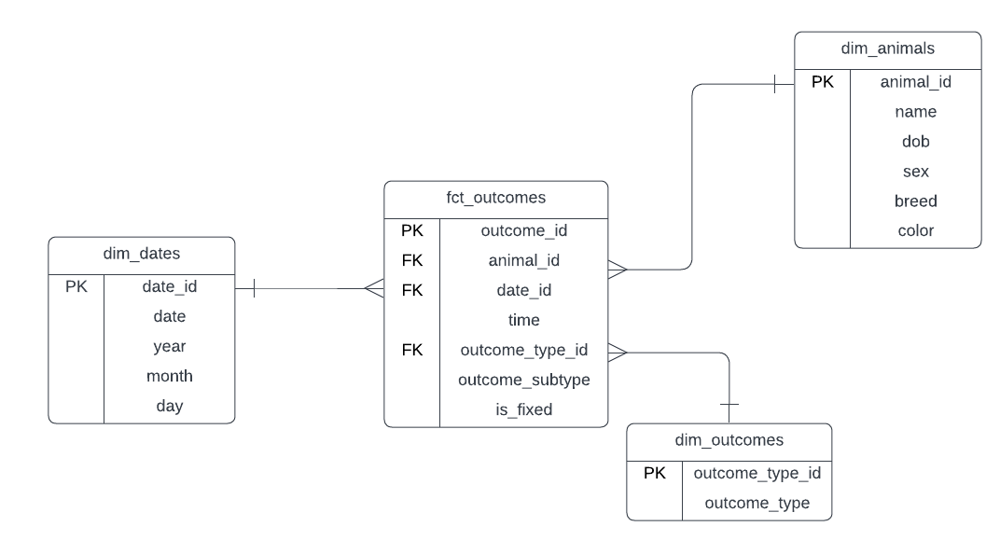

# Dimensional model (star schema)

In the [dimensional model with the star schema](https://en.wikipedia.org/wiki/Star_schema), we separate fact tables (tables that contain information about "transaction") from dimension tables (attributes of a "transaction"), and have foreign key relationships between facts and dimensions.

## Outcome fact table

In the case of animal shelter outcomes, the "transaction" is an outcome, so there will be a fact table with outcomes, `fct_outcomes`. There are different ways to chose a primary key for that table, but the most straighforward one is to have an autogenerated primary key that increments with every outcome.

## Animal dimension table
One dimension is immediately apparent: the information about specific animals should be a dimension, `dim_animals`. This table will have animal ID (from the data) as the primary key, and all the attributes of an animal.

## Other dimensions

The inventor of dimensional modeling, Ralph Kimball, has [very strict guidelines](https://www.kimballgroup.com/category/articles-design-tips/) for facts and dimensions. In reality, nowadays the data model is often determined by business and analytics needs, rather than dogmatic principles. 

For example, one common dimension is the _Date dimension_: the information about fact date is pulled into a separate table that often makes date-based analyses easier ("which day of the week has the most traffic"?). There are different schools of thought regarding what should serve as the primary key to the Date dimension. One of options is to just use the string representation of date. 

We also might want to separate information like outcome type into a separate dimension, and use a surrogate key to establish relationship with the fact table. This way if the description of the outcome type changes (for example, from "Adoption" to "Adopted"), our queries will still be working.

## Other considerations
An interesting consideration in our data is `"Sex upon outcome"` field from the original data, which contains information about the animal's sex, and whether they hae been spayed/neutered ("fixed"). The complication is that the animal can come into the shelter unneutered, but be neutered upon the outcome. SO the field contains information that petains both to the animal and to the outcome. 

One way to incorporate this into the model is to separate the `Sex upon outcome` field into two fields: one that would live in the animal dimension, and another that would live in the outcomes fact table. For simplicity, this is the approach we take here.

But on the other hand, an animal can arrive to the shelter once, get neutered, get adopted, and then arrive to the shelter again. In this case, the fact that animal is neutered is not a property of the second outcome. A better fit for representing this information might be using a slowly changing dimension.

